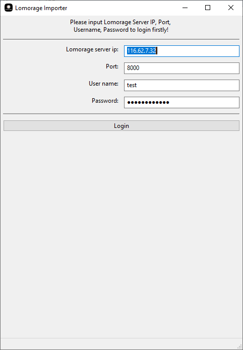
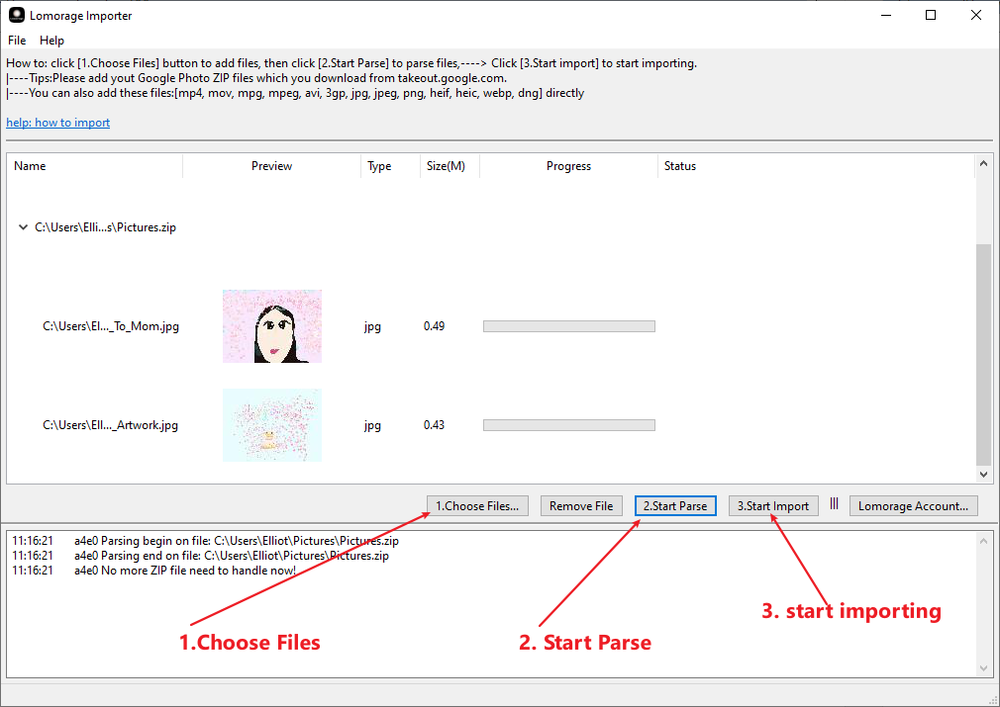

# lomo-importer-release: 

**This repo is for release lomo-importer tool with binary on Mac Os and Windows:**

**Please check the release page.**

**If you want to run this on other OS, please create issue or contact to us**

**[Contact](https://lomorage.com/contact/)**

# what is lomo-importer:

> **Batch import tool like: import Google Photos to Lomorage**

## Eg: how to import from Google Photo
### **1. download your google photo from takeout.google.com**
### **2. login to Lomorage server**
   
 

### **3. add all zip files to lomoimpt.exe(.app) and click "2.Start import" button**

# Note:
This is the **dev-version**, not the final release.
please create new issue on github for new feature or bugs.

support at lomorage.com is the email.

[slack channel](https://join.slack.com/t/lomorage/shared_invite/enQtODc4MTE5ODQzNzkyLTRlY2U4MTQ1YjczYjBhMDcwMmExYTUxNTg2NTE5YmRkZjg2ZWQwZjg1MjEwMjQzZWVjMmEwZjk3ZGIyODY4ODM)

# others:
## MacOS deploy:

> brew install hub
